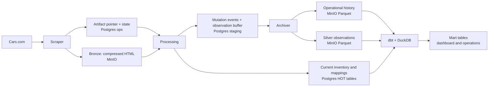

# CarTracker Architectural Overview

> Current-state narrative based on the source tree as of August 28, 2026.
> This document is intended to be useful both as an engineering reference and
> as source material for a conversational explanation of the system.

## The architectural idea in one sentence

CarTracker treats a vehicle listing as a fact that becomes progressively more
useful: it begins as immutable HTML in MinIO, becomes current operational state
and append-only events in Postgres, becomes typed historical Parquet in MinIO,
and finally becomes an analytical product in DuckDB through dbt.

That progression is the reason the project uses several storage engines rather
than asking one database to do everything. MinIO is inexpensive and replayable;
Postgres is good at coordination, atomic claims, and current-state lookups;
DuckDB is good at scanning columnar history without operating a warehouse
cluster. Airflow connects the stages, but deliberately keeps most business
logic inside the services and SQL models it invokes.



### How the data changes shape

| Layer | Physical home | Grain and shape | Why it exists |
|---|---|---|---|
| Bronze | MinIO | One Zstandard-compressed HTML object per fetched results or detail page | Preserves exactly what the site returned so parser changes are replayable |
| Operational | Postgres `ops` | One current row per artifact, listing, VIN mapping, claim, or cooldown | Supports low-latency point lookups, transactions, leases, and conflict handling |
| Staging buffers | Postgres `staging` | Append-only mutations and typed observations waiting for bulk export | Decouples small transactional writes from columnar object-store writes |
| Silver | MinIO Parquet | One typed observation per listing appearance, partitioned by source and date | Stores durable analytical history cheaply and in a scan-friendly format |
| Mart | DuckDB tables built by dbt | VIN-, listing-, hour-, cohort-, and benchmark-grain analytical products | Turns event and observation history into dashboard-ready business meaning |

The bucket is normally named `bronze`, but it contains more than the bronze
layer. Raw objects live under `html/...`; normalized operational event data
lives under `ops_normalized/...`; parsed observations live under
`silver_normalized/observations/...`. The prefixes, not separate buckets,
express the logical data tiers.

### Current-source truth versus older summaries

Two claims in the root README describe an earlier or aspirational version of
the design and do not match the current implementation:

1. The archiver does **not** flush staging events into the Postgres HOT tables.
   Processing updates the HOT row and appends its event in the same Postgres
   transaction. The archiver later exports the event buffer to Parquet and
   deletes the exported buffer rows.
2. `stg_blocked_cooldown_events` does **not** currently calculate
   `next_eligible_at` or `fully_blocked`. That dbt model is a typed projection
   of Parquet event history. The executable backoff that decides whether a
   listing can be claimed is in the Postgres `ops.ops_detail_scrape_queue`
   view. dbt uses the event stream for cohort, funnel, and block-rate analysis.

Those distinctions matter because they identify the actual consistency and
control boundaries: Postgres owns live application decisions; Parquet and dbt
own history and analytical interpretation.

## 1. `scraper/` and `cf_session.py`: looking like a browser without becoming one

### Why the scraper has two anti-detection layers

Cloudflare presents two different problems. Passive detection can reject a
client because its TLS handshake does not look like the browser claimed by its
HTTP headers. Active challenges require JavaScript and a real browser context
to mint a valid `cf_clearance` cookie. CarTracker separates these jobs:

- `curl_cffi` performs normal fetches while impersonating a supported desktop
  Chrome TLS fingerprint.
- FlareSolverr performs the expensive browser bootstrap and returns the page,
  browser user agent, and cookies.

The result is much cheaper than driving a browser for every page, but more
credible than attaching browser-looking headers to Python's ordinary TLS
stack.

### Matching the cookie, user agent, headers, and TLS fingerprint

`scraper/processors/cf_session.py` does not select a hard-coded impersonation
target after bootstrapping. It parses the Chrome major version reported by
FlareSolverr and maps it to an exact `curl_cffi` target where possible. If that
version is unavailable, it chooses the nearest supported lower Chrome version;
if the user agent cannot be parsed, it falls back to `chrome142`.

That coupling is intentional. A clearance cookie obtained by one browser and
replayed with a materially different TLS and client-hint identity is itself an
anti-bot signal. `make_cf_session()` therefore creates a fresh
`curl_cffi.requests.Session` with all four pieces aligned:

- the Chrome impersonation target;
- the FlareSolverr user agent;
- browser navigation and client-hint headers;
- cookies, including their domain and path attributes when available.

A fresh session is created for every caller because `curl_cffi` sessions are
not safe for concurrent use. The expensive credentials are shared; the mutable
network session is not.

### The FlareSolverr bootstrap and 25-minute credential cache

On a cache miss, `get_cf_credentials()` sends a FlareSolverr `request.get`
command to `/v1`, with the target URL and a millisecond timeout. A successful
solution supplies `userAgent`, cookies, response HTML, and an HTTP status.

The returned credential record is process-wide and guarded by a
`threading.Lock`. Expiry is tracked with `time.monotonic()`, which avoids clock
adjustments affecting the time-to-live. The TTL is 25 minutes: shorter than the
roughly 30-minute expected clearance lifetime, leaving a conservative margin.
The lock also means simultaneous scraper threads do not all launch a browser
bootstrap when the cache expires; one thread refreshes while the rest wait and
then reuse its result.

The cache-miss return contract contains a useful optimization. It returns both
the credentials and the HTML that FlareSolverr already fetched. A detail scrape
can use that HTML as its artifact rather than immediately request the same URL
again. A cache hit returns credentials only, and the caller performs its fetch
through a new replay session.

FlareSolverr's `status: ok` is not treated as proof that Cars.com was reached.
The code separately classifies the returned HTTP status and HTML title. A 403
or a known interstitial title such as “Just a moment...” is recorded as a
challenge outcome. The credential record is still cached: refusing to cache it
would hammer an already unhealthy solver on every request. That is a deliberate
liveness tradeoff, with telemetry and later circuit-breaking responsible for
making the failure visible.

### What happens on a 403

The two scraper paths react at slightly different boundaries:

- A results-page fetch invalidates the cache, increases a process-wide search
  penalty, and retries the same page once. The retry enters
  `get_cf_credentials()` with an expired cache and therefore re-bootstraps
  immediately. If the second response is also 403, the page becomes an error
  artifact and pagination stops.
- A detail-page fetch records the 403, updates `ops.blocked_cooldown`, and
  appends a cooldown lifecycle event. The batch wrapper then increases its
  adaptive delay and invalidates the credential cache. The **next** listing in
  that batch performs the re-bootstrap. The blocked HTML is still stored for
  diagnosis, but processing recognizes it as a challenge and refuses to treat
  it as a vehicle observation.

This is paired with behavioral throttling. Results scraping begins with an
8–20 second human-like delay, adds reading time on early pages, occasionally
adds a longer pause, rotates ZIP codes, and visits pages after page one in
random order. A shared 403 penalty starts at 45 seconds and can double to 120
seconds, then decays by 10 percent on successful pages. Detail scraping uses a
smaller adaptive delay, starting at 0.5 seconds, doubling to 30 seconds, and
decaying by 15 percent after success. The shared penalties acknowledge an
important physical fact: concurrent jobs share the same egress IP and browser
credentials, so a block is not local to a single thread.

### `scrape_results.py` and `scrape_detail.py` are a discovery/enrichment pair

The files do not call each other directly. They form a pipeline through
Postgres and MinIO:

1. `scrape_results.py` discovers listing cards for a make/model search. It
   learns page count from several generations of Cars.com markup, extracts
   listing VINs for early-stop logic, writes every fetched page to MinIO, and
   creates a `pending` `ops.artifacts_queue` row.
2. Processing parses those result cards and writes current listing/price state.
   That state feeds `ops.ops_detail_scrape_queue`, which selects listings whose
   price or dealer enrichment is stale.
3. `scrape_detail.py` fetches claimed listing URLs. Detail pages add richer
   vehicle and dealer attributes, expose related carousel listings, and reveal
   whether a listing is active, unlisted, or blocked.
4. Those detail pages become new bronze artifacts and travel through the same
   processing queue.

Search results are therefore the broad, cheaper discovery pass; detail pages
are the narrower, more expensive enrichment and lifecycle pass. The split is
why the project can limit anti-bot exposure without giving up detail-level
data.

The scraper service itself adds another concurrency layer. A four-thread
executor runs independent results jobs in the background, while a detail batch
has its own configurable thread pool whose production default is one worker.
Jobs are held in process memory and polled by Airflow, a pragmatic single-node
choice discussed later under portfolio tradeoffs.

## 2. `processing/` and the staging buffer tables: turning evidence into state

### Claiming a pointer, not moving HTML through Postgres

The queue row stores an artifact ID, MinIO URI, type, source identifiers,
fetch time, and status. HTML stays in MinIO. Every five minutes the
`results_processing` DAG calls `POST /process/batch`; the processing service
atomically changes up to 500 `pending` or `retry` rows to `processing` and
returns their pointers.

The core SQL uses a database-native competing-consumer pattern:

```sql
UPDATE ops.artifacts_queue
SET status = 'processing'
WHERE artifact_id IN (
    SELECT artifact_id
    FROM ops.artifacts_queue
    WHERE status IN ('pending', 'retry')
    ORDER BY artifact_id
    LIMIT %(limit)s
    FOR UPDATE SKIP LOCKED
)
RETURNING artifact_id, minio_path, artifact_type, ...;
```

`SKIP LOCKED` lets another processing caller make progress without waiting and
without receiving the same rows. Each status transition also produces a row in
`staging.artifacts_queue_events`, preserving operational history after the HOT
queue row is eventually cleaned up.

For each pointer, `read_html()` downloads and decompresses the Zstandard frame.
The normal bronze layout is:

`s3://bronze/html/year=YYYY/month=M/artifact_type=<type>/<uuid>.html.zst`

Cold HTML can also be served transparently from indexed pack files if the
original loose object has been pruned. That means reprocessing code keeps the
same artifact interface even after storage compaction.

### Results-page parsing

The current results parser supports both `fuse-card` and the earlier
`spark-card` components. Each card carries JSON in its
`data-vehicle-details` attribute. The parser normalizes identity, price, VIN,
make/model/trim, year, mileage, MSRP, financing and body attributes, seller
identifiers, and page position. It also constructs the canonical detail URL.

`write_srp_observations()` then resolves missing VINs in one batch lookup from
`ops.vin_to_listing`. For each card it:

- upserts current price/listing state in `ops.price_observations`;
- appends an `upserted` row to `staging.price_observation_events`;
- upserts a VIN mapping with a `mapped_at` recency guard;
- appends a `mapped` or `remapped` row to
  `staging.vin_to_listing_events` when the mapping changes;
- buffers a wide typed observation in `staging.silver_observations`.

The VIN mapping is more than a convenience join. Cars.com listing IDs can
change when a vehicle is relisted, while the VIN represents the durable
vehicle identity. Collision checks delete stale HOT observations for an old
listing ID before assigning the VIN to a newer one. The event stream retains
the fact that the remapping happened.

### Detail-page parsing

The detail parser starts with safety classification because not every HTML
response is a vehicle:

- If there is no valid `initial-activity-data` JSON and the title matches a
  Cloudflare challenge, the page is `blocked`. Processing marks the artifact
  `skip`, writes no observation, does not refresh freshness, and does not clear
  the cooldown.
- A Cars.com unlisted component or fallback “no longer available/listed” text
  produces `listing_state='unlisted'`.
- Otherwise the page is active. Primary vehicle facts come from
  `script#initial-activity-data`; dealer address, URL, rating, and related
  fields are enriched from the dealer card; `fuse-card`/`spark-card` carousel
  elements become lightweight related-listing observations.

For active details, the writer upserts the primary HOT observation, preserves
previous dealer enrichment when a later source has null fields, records
`last_detail_enriched_at`, updates the VIN mapping, optionally promotes
carousel observations that match tracked make/model configurations, clears a
resolved cooldown, and releases the detail claim. The primary observation and
VIN-mapping mutations have corresponding staging events in the same
transaction.

For an unlisted detail, the listing is deleted from
`ops.price_observations`, a `deleted` price event is appended, the cooldown is
cleared, and an unlisted silver observation with a null price is buffered. In
other words, absence from the current HOT table expresses current state, while
the event and silver records preserve the historical transition.

### Three writes, three meanings

It is helpful to distinguish the destinations created by one parsed listing:

| Write | Example | Meaning |
|---|---|---|
| HOT state | `ops.price_observations`, `ops.vin_to_listing` | What the application believes now |
| Mutation event | `staging.price_observation_events`, `staging.vin_to_listing_events` | What changed, and from which source/artifact |
| Silver buffer | `staging.silver_observations` | The full typed observation to retain for analytics |

The principal HOT upsert or delete and its corresponding mutation event share
a Postgres transaction, so normal current-state writes do not commit without
their audit event. Relisting-collision cleanup is a narrower exception: the SRP
bulk guard and carousel path can remove a stale conflicting HOT row without
always emitting a separate `deleted` event for that cleanup. The wide
silver-buffer insert happens through a separate call and is deliberately
non-fatal: a failure is logged and counted as `silver_write_failures`, but a
successfully parsed artifact can still be marked complete. That keeps the
operational pipeline moving, at the cost of requiring monitoring or bronze
replay to repair a missed silver row.

Read or parse failures return the artifact to `retry`. A confirmed challenge or
unknown artifact type becomes `skip`. These statuses make recovery a state
transition rather than an exception hidden in an Airflow log.

## 3. `archiver/` and the bulk flush: converting transactions into columnar history

The archiver has two related but distinct flush paths. Neither calculates
business state; both move bounded snapshots out of short-lived Postgres
buffers.

### Operational event flush

`flush_staging_events.py` exports queue, claim, cooldown, price, VIN-mapping,
and coordination events to:

`s3://bronze/ops_normalized/<event_table>/year=YYYY/month=MM/part-*.parquet`

For each staging table independently, the processor:

1. reads `MAX(primary_key)` to establish a snapshot boundary;
2. selects ordered rows at or below that boundary;
3. coerces UUIDs, timestamps, and JSON fields into an explicit PyArrow schema;
4. writes a Hive-partitioned, Zstandard-compressed Parquet dataset;
5. deletes only rows at or below the captured boundary, and only after the
   object-store write succeeds.

Rows inserted during the export have a higher ID and remain for the next run.
A failure on one event table is rolled back and reported without preventing
the other event tables from flushing.

The delivery semantics are intentionally at least once. If the process writes
Parquet and dies before its Postgres delete commits, the same event IDs can be
written again under a new part filename. The code and comments accept possible
duplicates in append-only history; downstream uniqueness tests and
deduplication policy are therefore important recovery signals.

### Silver observation flush

`flush_silver_observations.py` uses the same snapshot/write/delete protocol for
`staging.silver_observations`. It adds a `written_at` timestamp and derives
partition columns from `fetched_at`, then writes:

`s3://bronze/silver_normalized/observations/source=<srp|detail|carousel>/obs_year=YYYY/obs_month=MM/part-*.parquet`

Partitioning first by source helps dbt distinguish the authority and density
of result, detail, and carousel observations; time partitions limit the amount
of history read for bounded investigations and maintenance. `obs_day` remains
inside the file rather than becoming another directory level, avoiding an
excess of small partitions.

### How DuckDB reads MinIO directly

The dbt DuckDB target loads `httpfs` and `postgres_scanner`. Its profile sets a
scheme-free MinIO endpoint, access key and secret, path-style URLs, no TLS for
the internal network endpoint, two DuckDB threads, and an 8 GB memory limit.

In `dbt/models/sources.yml`, Parquet sources declare an
`external_location` such as:

```sql
read_parquet(
  's3://bronze/silver_normalized/observations/**/*.parquet',
  hive_partitioning=true
)
```

At the start of a DuckDB dbt run,
`register_upstream_external_models()` registers those expressions as external
views. Models can then use ordinary dbt `source()`/`ref()` lineage while
DuckDB's `httpfs` reads the Parquet objects in place. There is no copy into a
separate warehouse and no second set of credentials hidden in model SQL.

For non-dbt operational queries, `shared/duckdb_s3.py` provides the same
configuration explicitly. Credentials are passed as bound parameters rather
than interpolated into SQL. A portability macro also renders the same Parquet
sources as `parquet.` paths for an experimental Spark target, showing that the
logical model graph is not completely coupled to DuckDB syntax.

## 4. `dbt/` models and 403 backoff: analytics beside the control plane

### dbt is more than a reporting query runner

dbt organizes the durable history into tested semantic layers:

- staging models normalize Parquet observations, price events, cooldown
  events, and Postgres configuration sources;
- intermediate models resolve source priority, latest observation, price
  history, state fingerprints and runs, volatility, and benchmarks;
- mart tables produce vehicle snapshots, deal scores, inventory coverage,
  scrape volume, freshness trends, detail outcomes, block rates, and cooldown
  cohorts.

The hourly Airflow path flushes both Parquet streams before running the
`hourly_core` dbt selection. That ordering makes the mart refresh part of the
application's operating rhythm, not an unrelated offline report. The
dashboard and health metrics consume those modeled products.

The project nevertheless keeps the live scrape queue available even when
DuckDB or dbt is unavailable. That is why current-state eligibility is a
Postgres view over HOT tables rather than a dependency on the latest hourly
mart build.

### The actual exponential-backoff path

A detail 403 causes the scraper to atomically upsert
`ops.blocked_cooldown`: the first failure creates attempt 1, while each conflict
updates `last_attempted_at` and increments the count. It also appends a
`blocked` or `incremented` lifecycle event.

The operational detail queue excludes a row until this predicate passes:

```sql
bc.num_of_attempts < 5
AND bc.last_attempted_at
    + interval '1 hour'
      * (12 * power(2, bc.num_of_attempts::float - 1))
    < now()
```

This is equivalent to:

| Attempt | Wait after the latest 403 | Operational cohort |
|---:|---:|---|
| 1 | 12 hours | cooling down |
| 2 | 24 hours | cooling down |
| 3 | 48 hours | cooling down |
| 4 | 96 hours | cooling down |
| 5+ | no next eligibility | fully blocked |

Earlier migrations exposed the expression with the names
`next_eligible_at` and `fully_blocked`; the current view inlines it. This is
the application control logic that prevents a blocked listing from being
hammered every 15 minutes.

A successful active or unlisted parse deletes the live cooldown and emits a
`cleared` event. Maintenance also emits `cleared` when a listing disappears
from live inventory. Those lifecycle events are flushed to Parquet.

`stg_blocked_cooldown_events` currently selects the event ID, listing ID,
event type, attempt count, and event time from that Parquet history. The dbt
marts then apply analytical state logic. `mart_cooldown_cohorts`, for example,
uses `arg_max` by event time to recover the latest attempt and event for each
listing, excludes listings whose latest event is `cleared`, and buckets the
remaining backlog into `1`, `2`, `3-4`, `5-10`, and `11+`. Related marts show
the event funnel and hourly block rate.

This split is a useful architectural lesson: the same 403 has two projections.
Postgres answers “may this listing run now?”; dbt answers “what is the shape and
trend of blocking over time?” The formulas are related, but only the first is
on the scraper's critical path.

## 5. `ops/` and Caddy forward-proxy authorization

### Authentication and authorization are deliberately separate

Caddy terminates public TLS and applies two `forward_auth` checks to protected
routes:

1. It calls oauth2-proxy at `/oauth2/auth`. oauth2-proxy owns the Google OAuth
   flow and session cookie. On success, Caddy copies
   `X-Auth-Request-Email` and `X-Auth-Request-User` into the protected request;
   on 401 it redirects the browser to sign in.
2. It calls the internal ops service at `GET /auth/check`, optionally with
   `?require=observer` or `?require=admin`. Ops trusts the email header from the
   first internal check, looks up its role, and returns `X-User-Role`. A 403 is
   redirected to `/request-access`.

The `/request-access` route requires Google authentication but intentionally
does not require prior database authorization. That is how an authenticated
unknown user can request entry.

Route groups apply increasingly strict minimums. Dashboard routes accept any
authorized role. General `/admin*` routes require observer or higher. User
management, Airflow, Grafana, MinIO console, and pgAdmin require admin. The
role hierarchy in the ops service is:

`viewer < observer < power_user < admin`

For defense in depth, ops middleware rejects mutating HTTP methods from an
observer even after Caddy admits the request. Thus “observer” is not merely a
navigation choice; it is enforced at the application boundary.

### Why no dedicated identity service is required

Google and oauth2-proxy answer “who authenticated?” Ops and Postgres answer
“what may that person do here?” The `authorized_users` table is small and
changes infrequently, so a separate identity microservice would add deployment
and failure surface without adding useful capability. The authorization check
is internal and colocated with the service that already owns user approval and
admin workflows.

Downstream services do not parse OAuth tokens or query the user table. They
receive traffic only after Caddy has applied the route policy. This is a clean
edge-security design as long as protected services and `/auth/check` are not
directly reachable from an untrusted network where callers could forge the
identity headers.

### Email pseudonymization

The lookup key is calculated as:

```python
sha256((AUTH_EMAIL_SALT + email.lower()).encode()).hexdigest()
```

Only the deterministic hash is normally stored in `authorized_users` and
`access_requests`, which permits equality lookup without storing an email
address in plaintext. The fixed secret salt prevents the same email from
having a universal hash across unrelated systems and raises the cost of a
precomputed email dictionary. Notification email is opt-in, is nulled after an
approval/denial notification, and has a 48-hour cleanup safety net.

This is pseudonymization, not encryption and not password hashing. Emails have
a relatively small guessable space, so disclosure of both the database and
salt would permit offline guessing. The code also defaults a missing salt to
an empty string, making production secret validation an important deployment
control. The design is appropriate for deterministic authorization lookup,
but the secret should be high entropy, kept outside the database, rotated with
a planned rehash, and validated as non-empty at startup.

## 6. `airflow/dags/` and concurrency patterns

### Major DAG relationships

The DAGs coordinate service APIs rather than embedding parsers or storage code.
This “fat services, thin DAGs” choice makes the same endpoints usable by a
future event consumer or a manual recovery tool.

| DAG | Actual schedule | Role in the data flow |
|---|---|---|
| `scrape_listings` | Every 30 minutes, with rotation guards that limit real work | Advances a configuration slot, fans out search config × scope, submits results jobs, and polls them |
| `scrape_detail_pages` | Every 15 minutes | Claims eligible detail work, submits one batch, polls the scraper, and releases claims with an `all_done` cleanup task |
| `results_processing` | Every 5 minutes | Asks processing to claim and parse both results and detail artifacts |
| `hourly_analytics_refresh` | Hourly | Flushes silver observations, flushes operational events, runs the `hourly_core` dbt graph, then reconciles cooldown lifecycle history |
| `flush_silver_observations` | Manual wrapper | Runs only the silver archiver endpoint; scheduled ordering belongs to the hourly DAG |
| `flush_staging_events` | Manual wrapper | Runs only the operational-event archiver endpoint |
| `dbt_build` | Manual wrapper | Runs a selective or full dbt build outside the hourly schedule |
| `orphan_checker` | Every 5 minutes | Expires stale detail claims, reaps artifacts stranded in `processing`, and evicts cooldowns for delisted vehicles |

Deploy-intent and service-health sensors sit before work. Maintenance-heavy
claim and processing tasks share an Airflow pool so operational housekeeping
does not stampede Postgres during deployment or recovery. Scrape DAGs also set
`max_active_runs=1`, preventing schedule overlap inside a DAG.

### Atomic detail claims without a queue broker

The detail queue is a Postgres view, while `ops.detail_scrape_claims` is the
lease table. Claiming is one statement containing a candidate CTE and an
insert:

```sql
INSERT INTO detail_scrape_claims
    (listing_id, claimed_by, claimed_at, status)
SELECT listing_id, :run_id, now(), 'running'
FROM batch
ON CONFLICT (listing_id) DO UPDATE
SET claimed_by = EXCLUDED.claimed_by,
    claimed_at = EXCLUDED.claimed_at,
    status = 'running'
WHERE detail_scrape_claims.status != 'running'
RETURNING listing_id;
```

The primary/unique key on `listing_id` is the concurrency primitive. If two
claimers see the same candidate, one insert wins. The loser reaches the
conflict branch, sees that the existing claim is already `running`, fails the
conditional update, and receives no returned row for that listing. Non-running
stale rows can be reclaimed cleanly and assigned a new run ID.

This is separate from the artifact claim pattern. Detail claims prevent two
scrapers from fetching the same listing; `FOR UPDATE SKIP LOCKED` prevents two
processing consumers from parsing the same stored artifact. Both use Postgres
transactions, but at different grains and stages.

### Crash recovery and the orphan checker

A normal detail run releases its claims even if the scrape task fails, because
the Airflow release task uses `trigger_rule='all_done'`. If the worker or
container disappears before that cleanup can run, the claim remains
`running`. Every five minutes, `orphan_checker` calls an ops maintenance
endpoint that deletes running claims older than two hours. The listing then
becomes eligible for a later claim.

The same DAG repairs artifacts left in `processing`: if the bronze object is
still readable, it changes the status to `retry`; if the object is missing, it
changes it to `skip` to prevent an infinite retry loop. This makes leases and
queue states recoverable without pretending that process death can be handled
by an in-memory `finally` block.

The two-hour timeout is a pragmatic lease rather than distributed consensus.
It must remain longer than a healthy batch's expected work, or a slow live
worker and the orphan checker could overlap. Airflow's three-hour detail-task
timeout and the claim expiry deserve to be tuned together whenever batch size
or request concurrency changes.

## 7. Strength as a mid-senior data platform portfolio project

CarTracker is a strong mid-senior portfolio piece because its interesting work
is in the failure boundaries, not only in a polished dashboard. The current
repository contains 47 Flyway migrations, 17 operational DAG files, 23 dbt SQL
models, and 155 Python test modules. More important than the counts, the code
shows repeated ownership decisions that an interviewer can interrogate.

### What the project demonstrates particularly well

- **Storage-engine judgment.** It can explain why raw evidence, mutable state,
  append-only history, and analytical marts have different physical needs.
- **Replay and lineage.** Bronze HTML survives parser bugs; artifact IDs flow
  into operational mutations and silver rows; dbt sources name the Parquet
  locations explicitly.
- **Concurrency without hand-waving.** Locks, `SKIP LOCKED`, conflict-aware
  claims, lease expiry, single-flight dbt builds, and process-local adaptive
  penalties solve different concurrency problems at the correct boundary.
- **Failure semantics.** Retry, skip, blocked, unlisted, cleared, and orphaned
  are represented as data. The archiver uses write-before-delete snapshots,
  and the parser prevents an anti-bot page from refreshing business state.
- **Operational SQL as architecture.** Recency-guarded VIN mappings, relisting
  collision cleanup, exponential cooldowns, and HOT/event dual writes show
  that SQL is being used for invariants rather than as passive persistence.
- **Analytics engineering depth.** The dbt graph models source priority,
  late-arriving history, state runs, price trajectories, benchmarks, and
  operational cohorts directly over object storage.
- **Security and operability.** Edge authentication, DB-backed role checks,
  observer read-only enforcement, migrations, metrics, logs, alerts, service
  readiness, and deploy gates make the project feel operated rather than merely
  assembled.
- **Testing at several boundaries.** Parser fixtures, service tests, SQL smoke
  tests, dbt unit/integration tests, and DAG integrity tests make architectural
  contracts executable.

The best podcast or interview framing is not “I used many tools.” It is “I gave
each tool one job, then designed the handoffs so a failure becomes observable
and recoverable.” The strongest narrative moments are the credential/session
split, the raw-pointer queue, the HOT-plus-event transaction, the
snapshot-boundary flush, and the dual operational/analytical interpretation of
a 403.

### Honest tradeoffs that make the story more credible

The project also has boundaries worth naming openly:

- The scraper's credential cache and asynchronous job registry are
  process-local. Multiple scraper replicas would not share a clearance token
  or job status, and a restart loses pollable job metadata. Scaling out would
  require an external job/lease store and a deliberate session-affinity model.
- The silver-buffer write is not in the same transaction as the HOT/event
  write. A non-fatal failure can create a historical gap until bronze replay
  repairs it.
- Archiver delivery is at least once, so a crash between Parquet write and
  buffer deletion can duplicate event IDs. Downstream deduplication should be
  explicit if exact-once analytical counts become a requirement.
- The operational cooldown formula lives in a Flyway-managed Postgres view,
  while dbt owns cooldown analytics. That is a defensible availability choice,
  but README wording should not imply dbt controls the live queue.
- Deterministic salted email hashes reduce casual exposure but are not
  irreversible anonymization. Production should fail closed when the salt is
  missing.
- Several schedulers, services, and stores are appropriate for demonstrating
  platform concepts, but they impose operational cost. At small scale, this is
  a conscious portfolio trade rather than proof that every deployment needs
  the same topology.

These are not reasons to weaken the portfolio claim. They are the material for
a senior conversation about evolution: which guarantees are already strong,
which are intentionally eventual, and what would have to change before adding
replicas, increasing throughput, or treating the platform as a multi-tenant
service.

## Closing narrative: one vehicle, four identities

A Cars.com vehicle crosses CarTracker under four identities. First it is bytes:
the exact page that arrived, challenge and all. Then it is operational state: a
listing ID, a VIN mapping, a current price, a claim, or a cooldown. Then it is
history: immutable typed observations and mutation events in Parquet. Finally
it is an analytical entity: a VIN with price runs, freshness, benchmark
position, deal score, and scrape-health context.

The architecture works because it does not collapse those identities too
early. Raw evidence remains replayable. Current state remains fast. Historical
events remain cheap to scan. Analytical meaning remains rebuildable. The
concurrency and anti-detection mechanisms are not side features around that
pipeline; they are what make the transitions trustworthy when the source site,
network, workers, or schedulers do not behave ideally.

## Source map

The principal implementation files behind this overview are:

- Scraper and anti-detection: `scraper/processors/cf_session.py`,
  `scraper/processors/fingerprint.py`, `scraper/processors/scrape_results.py`,
  `scraper/processors/scrape_detail.py`, `scraper/app.py`
- Bronze storage: `shared/minio.py`, `shared/compression.py`
- Processing and parsing: `processing/routers/batch.py`,
  `processing/processors/results_page_cards.py`,
  `processing/processors/parse_detail_page.py`,
  `processing/writers/srp_writer.py`,
  `processing/writers/detail_writer.py`,
  `processing/writers/silver_writer.py`
- Buffer export: `archiver/processors/flush_staging_events.py`,
  `archiver/processors/flush_silver_observations.py`
- DuckDB and dbt: `dbt/profiles.yml`, `dbt/models/sources.yml`,
  `dbt/macros/parquet_source.sql`,
  `dbt/models/staging/stg_blocked_cooldown_events.sql`,
  `dbt/models/marts/mart_cooldown_cohorts.sql`, `shared/duckdb_s3.py`
- Operational backoff and claims:
  `db/migrations/V040__detail_scrape_circuit_breaker.sql`,
  `ops/routers/scrape.py`, `ops/routers/maintenance.py`
- Security: `Caddyfile`, `oauth2-proxy/oauth2-proxy.cfg`,
  `ops/routers/auth.py`, `ops/app.py`,
  `db/migrations/V009__authorized_users.sql`
- Scheduling: `airflow/dags/scrape_listings.py`,
  `airflow/dags/scrape_detail_pages.py`,
  `airflow/dags/results_processing.py`,
  `airflow/dags/hourly_analytics_refresh.py`,
  `airflow/dags/orphan_checker.py`
