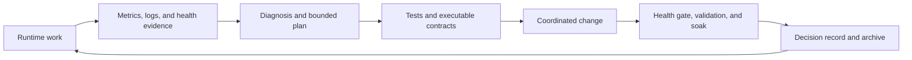

# CarTracker Operational Engineering Overview

## Observability, Deployment, Storage Economics, Testing, and Planning

**Companion to:** [CarTracker Architectural Overview](ARCHITECTURAL_OVERVIEW.md)  
**Codebase reviewed:** 2026-08-31

> **Long-form narrative — not front-door copy.** This document feeds
> `README.md` by paraphrase only, and the reason is register, not secrecy.
> Nothing here is undisclosed; the repository is public. Its case studies are
> written at deep-dive length for a reader who already wants the mechanism,
> and lifting them into the README or landing page produces front-door copy
> written for the wrong reader — which is what
> [Plan 138](plans/plan_138_public_surface_refresh.md)'s non-goals rule out.
>
> Unlike its companion, this document prints no production object prefixes and
> carries no solver or session-bootstrap detail. The passages most often
> mistaken for public copy are the storage-economics and liveness case
> studies, which are already paraphrased into the README.

---

## 1. The Second Half of the Architecture

The first architectural overview follows a vehicle listing as it changes shape: raw HTML in MinIO, operational events in Postgres, Parquet history in the lake, and analytical models in DuckDB and dbt. This follow-up asks a different question:

> What makes that pipeline safe to operate when containers fail, disks fill, schemas change, a deployment interrupts work, or an optimization needs to delete millions of source objects?

That is where much of CarTracker's most mature engineering lives. The project is not merely a scraper surrounded by monitoring. It is a collection of explicit operational contracts:

- a log is retained only if it has an actionable classification;
- a service is healthy, unhealthy, or known to lack a healthcheck—never silently “probably fine”;
- a deployment may mutate containers only after in-flight work drains;
- a failed partial deployment holds the pipeline closed;
- a bronze object may be deleted only after its packed replacement returns the same bytes;
- a planning claim is valid only if it has one owner, one state, and evidence that can be audited.

These contracts form a control loop around the data pipeline:

The important architectural idea is not the particular tools. Prometheus, Grafana, Loki, Docker Compose, GitHub Actions, and Markdown all serve the same purpose: replacing assumptions with evidence that another part of the system can act on.

---

## 2. Observability: Designing Signals Around Failure Modes

### 2.1 Four complementary views of the system

CarTracker's observability stack separates four questions that are often collapsed into one:

| Question | Primary mechanism | Why it exists |
|---|---|---|
| Is a process reachable? | Docker healthchecks and `container-health` | Detect dead, unhealthy, missing, or uninstrumented services |
| Is useful work happening? | Prometheus application and Airflow metrics | Detect a healthy process that has stopped producing outcomes |
| What happened inside a request or job? | Structured JSON logs in Loki | Preserve actionable diagnostic context |
| Is the data product still fresh and plausible? | dbt-runner analytics snapshot metrics | Detect semantic failure after infrastructure still looks healthy |

This separation matters. A scraper can return HTTP 200 from `/health` while every Cars.com request is blocked. Airflow can be running while its metrics disappear because a UDP sender cached an obsolete container address. A dbt process can finish successfully while the latest analytical hour is incomplete. No single “service up” metric can represent all of these states.

Prometheus scrapes infrastructure exporters, application services, Airflow's StatsD bridge, MinIO, Postgres, Promtail, and the custom container-health exporter every 15 seconds. Grafana then presents the signals through four main dashboard families: infrastructure, logs, pipeline health, and service latency.

### 2.2 Direct scraper telemetry closes a blind spot

The most instructive metrics are also among the smallest. [`scraper/metrics.py`](../scraper/metrics.py) publishes two counters:

- `cartracker_solver_requests_total`, labeled `ok`, `challenge`, or `error`;
- `cartracker_detail_fetch_total`, labeled `ok`, `403`, or `error`.

They were added after an eight-hour solver outage that downstream analytics did not reveal promptly. The pair distinguishes two anti-detection failures:

1. The solver can refuse to establish a usable browser session. Solver failures rise and successful bootstraps disappear.
2. The solver can claim success while returning a challenge page. Bootstrap metrics look acceptable, but detail-fetch 403s rise and successful fetches disappear.

The labels are initialized at process start, so a genuine zero produces a time series rather than an absent series. Metric recording is also deliberately unable to raise into the scrape path. Telemetry is important, but it must not become a new reason scraping fails.

This is a good example of observability following causality. The earlier, downstream signal asked “did data arrive?” The new counters ask “did the two external interactions that permit data to arrive actually work?”

### 2.3 Analytics metrics are published snapshots, not live analytical queries

Operational dashboards also expose observations per hour, artifact volume, extraction yield, block events, stale-listing percentages, and cooldown cohorts. These are analytical questions, but Prometheus does not query the DuckDB marts during every scrape.

Instead, [`dbt_runner`](../dbt_runner/metrics.py) refreshes an in-memory snapshot after analytical work. The SQL in [`analytics_metrics_snapshot.sql`](../dbt_runner/sql/analytics_metrics_snapshot.sql) explicitly selects the latest **complete** UTC hour. Excluding the current partial hour prevents an ordinary clock boundary from manufacturing a volume-drop incident.

The snapshot publisher also exposes its own freshness and refresh-success metrics. If the underlying analytical read fails, gauges become unavailable rather than retaining an old value that still looks healthy. This gives the dashboard two independent facts:

- what the last complete analytical window said;
- whether that statement is recent enough to trust.

That pattern keeps a slow analytical engine away from Prometheus's hot scrape path and makes stale data distinguishable from a valid zero.

### 2.4 Structured logging is a retention policy, not just a formatter

Application services write human-readable stdout and rotating JSON files through [`shared/logging_setup.py`](../shared/logging_setup.py). The files are bounded at 5 MB with three backups, so the log transport cannot grow without limit while Loki is unavailable.

The JSON records include only an allowlisted set of scalar correlation fields such as `artifact_id`, `listing_id`, `dag_id`, `task_id`, `run_id`, `request_id`, `trace_id`, `span_id`, `duration_ms`, and `outcome`. Long strings and arbitrary payloads are excluded. This reduces cardinality, disk growth, and the chance that request bodies or secrets become durable by accident.

Promtail then applies source-specific ingestion rules:

- application JSON files retain classified records and promote stable fields into searchable labels;
- selected Docker stdout streams are parsed according to the actual format of Airflow and oauth2-proxy;
- routine successful oauth2-proxy authorization checks are dropped because they are both high-volume and privacy-sensitive;
- Airflow control-plane `DEBUG` and `INFO` chatter is dropped while actionable severities remain;
- unclassified records are dropped and counted by reason.

The subtle but valuable part is that [`shared/log_ingestion_policy.py`](../shared/log_ingestion_policy.py) models this policy as code. Unit tests check the classification model, and CI replays fixtures through the real Promtail image using [`verify_promtail_contract.py`](../scripts/verify_promtail_contract.py). Syntax validation alone would prove only that the YAML loads; replay proves that the production Go pipeline and the Python policy still agree.

Loki is intentionally a single-node internal service with filesystem storage and 90-day retention. It is an operational search system, not a permanent audit warehouse. Docker and rotating file logs are bounded transport buffers; Loki owns the searchable retention window.

### 2.5 Health is three-state, and absence is failure

Docker's native health state has an awkward gap: a stopped or removed container can disappear from the query entirely. CarTracker closes it with the custom [`container_health`](../container_health/collector.py) exporter and a checked-in expected-service set.

For every expected long-running service, the exporter publishes:

- `1` — healthy;
- `0` — unhealthy, not running, or absent;
- `-1` — running but no healthcheck is configured.

The `-1` is intentionally unattractive. Treating “healthcheck missing” as healthy would reward a coverage gap. A separate coverage alert makes it visible without confusing it with a live incident.

The expected set is not inferred only from containers Docker currently remembers. [`container_health/expected.py`](../container_health/expected.py) contains the resolved 28-service production set, and tests assert exact agreement with [`maintenance-running-set.txt`](../maintenance-running-set.txt) and the Compose definitions. Profile-gated but production-critical services such as `trawl` and `redis-trawl` are included; one-shot tools such as Flyway are excluded for a documented reason.

Healthchecks themselves are shallow. They prove that the process can serve its own liveness endpoint, not that Postgres, MinIO, or every dependency is healthy. This prevents one database incident from turning the entire Compose fleet unhealthy and preserves the location of the original fault.

The exporter also emits memory usage and limits for capped containers. Its usage calculation subtracts inactive page cache, matching Docker's human-facing interpretation. If the Docker fleet query fails completely, the exporter raises and Prometheus records `up = 0`; an empty result is never converted into an all-green fleet.

### 2.6 Alerts reflect missing success, not only visible errors

Grafana's provisioned alerts cover infrastructure, application outcomes, logs, and analytical quality. Representative examples include:

- no successful solver bootstrap within 15 minutes while non-success outcomes accumulate;
- no successful detail fetch within 20 minutes while attempts continue;
- a detail 403 ratio above 5% with enough samples to make the ratio meaningful;
- Airflow DAG failures and excessive scheduling delay;
- container absence/unhealthiness and missing healthcheck coverage;
- stale coordination evidence or an unhealthy release gate;
- stale analytics metrics, volume drops, extraction-yield loss, cooldown backlog, and block-event spikes;
- disk and inode warning/critical thresholds, plus predicted inode exhaustion within seven days;
- any refusal during packed-source deletion.

The distinction between “errors exist” and “success disappeared” is crucial for scraping. A solver that hangs quietly may produce no error spike. A no-success alert still fires.

Notifications are grouped by alert and service, sent through Telegram, and repeated less aggressively for coverage defects than for incidents. Health sensors inside Airflow are treated as workflow gates, not duplicate paging systems. If a dependency is down, the container-health alert names the service; a DAG task does not send a second, misleading “pipeline failed” notification for the same cause.

### 2.7 What is deliberately not present yet

CarTracker has correlation fields ready for `trace_id` and `span_id`, but it does not currently deploy an OpenTelemetry collector or Tempo. [Plan 151](plans/plan_151_distributed_tracing_and_runtime_topology_audit.md) starts with a bounded, metrics-only experiment and permits a tracing backend only if aggregate telemetry cannot answer a recorded diagnostic question.

That restraint is architecturally healthy. Distributed tracing has a storage and cognitive cost. The project treats it as an answer to a demonstrated question, not as an observability maturity badge.

---

## 3. Deployment: Coordinating Change With Work in Flight

### 3.1 A single-host Compose platform with explicit service roles

Production is a Docker Compose deployment rather than Kubernetes. The Compose file defines the application services, Postgres, MinIO, Airflow, the anti-detection solver, the observability stack, the proxy/auth layer, and one-shot migration or maintenance workers.

This is a deliberate scale choice. The system needs service isolation, restart policies, healthchecks, profiles, resource limits, volumes, and an internal network. It does not yet have a measured multi-host scheduling or availability requirement. The roadmap makes that trigger explicit: Kubernetes becomes relevant when genuine multi-host needs exceed Compose, not when the YAML becomes long.

Flyway is a one-shot service. Consumers depend on it completing successfully rather than pretending it should remain healthy forever. Long-running services use `restart: unless-stopped`; profile-gated tools and recovery workers remain off unless explicitly invoked. Airflow itself runs as separate API server, scheduler, DAG processor, and triggerer processes, while still using `LocalExecutor` for workload execution.

### 3.2 Targeted redeployment is a state machine

The operational path in [`scripts/redeploy.sh`](../scripts/redeploy.sh) is more sophisticated than “build, restart, sleep.” It treats deployment as a sequence of claims that must become true:

1. Request scoped deploy coordination for the named services.
2. Begin a drain and poll until in-scope admitted work is gone.
3. Build and recreate only the requested services with `--no-deps`, or restart them when the intent is to reload a process/configuration.
4. Wait for each pollable target to reach its actual Docker health state.
5. Enter validation and collect release evidence.
6. Release the coordination gate only when the fleet is safe.

The default health timeout is 300 seconds because the slowest checked-in health contract can consume 230 seconds: `start_period + retries × (interval + timeout)`. Tests assert that the script timeout stays above the Compose contract. This turns a deployment assumption into a cross-file invariant.

Two failure branches protect availability differently:

- If validation fails before any container changes, coordination is released. The pipeline does not remain paused for a change that never happened.
- If a container was recreated or restarted and a later step fails, coordination remains **held**. The fleet may now be mixed-version, so resuming background jobs would be less safe than a visible pause.

This is fail-closed deployment. Failure does not merely return a non-zero shell status; it changes what scheduled work is allowed to do.

### 3.3 Drain evidence is scoped and authoritative

The ops service owns the coordination state. During a drain, it inspects active Airflow task instances, service readiness, queue/work sources, one-off processes, and Airflow gate observations. Pending work does not necessarily block a deploy; work already admitted and executing does.

Every mutating DAG begins with a deploy-intent sensor. The sensor has no short operational timeout: a planned pause should not turn into a collection of red DAGs just because maintenance took longer than expected. Each DAG records that it observed the current coordination generation, allowing release logic to distinguish a real acknowledgment from an old one.

Release logic re-reads authoritative state rather than trusting cached answers. It verifies the expected running set, container health, core HTTP endpoints, coordination freshness, and other scoped evidence. Missing or unreadable evidence is a blocker, never permission to continue.

### 3.4 Restart and recreate are different operations

The deployment tooling preserves a distinction that Compose output can obscure:

- **Recreate** builds a potentially new image and replaces a container.
- **Restart** keeps the image and container identity but restarts the process so it reopens files or re-resolves peers.

This matters for single-file bind mounts. A `git pull` may replace the host file's inode while the container remains bound to the old, unlinked inode. Sending `SIGHUP` can then produce a convincing reload message while reading stale configuration. Restart mode re-resolves the mount and, where possible, verifies host and container inode identity.

The inverse hazard appears when a container is recreated: its internal IP may change. Most TCP clients reconnect and re-resolve, but a long-lived UDP client can keep sending to an obsolete address with no exception. [`deploy-followers.txt`](../deploy-followers.txt) records these relationships. The known example is Airflow's StatsD client after `statsd-exporter` recreation. The script warns which peers need a follow-up restart but does not silently restart services outside the operator's requested scope.

It also compares container IDs before and after `docker compose up`. If Compose found no drift, the script says that no container was recreated instead of reporting a fictional deployment success.

### 3.5 Host maintenance extends the same contract across a reboot

[`scripts/host_maintenance.py`](../scripts/host_maintenance.py) generalizes deploy coordination into a checkpointed host lifecycle:

`plan → request → preflight → drain → stop → prepare/update → reboot → start → validate → complete`

Preflight captures the boot ID, running-set manifest, mounts, disk headroom, Docker configuration, package state, failed systemd units, DNS, time synchronization, and other host facts as structured evidence. Package application requires explicit release-note review. Reboot requires an explicit confirmation flag. After restart, validation compares the new host against the preflight facts and fails closed when evidence is missing or malformed.

The checkpoint is append-only JSON Lines under a fixed host path. Evidence writes refuse symlink traversal, and evidence bundles are hashed before being submitted to the ops coordination service. The running-set policy prevents recovery from resurrecting stale sibling-project containers merely because their Compose files exist on disk.

This is operational architecture expressed as a state machine: a reboot is not “done” when SSH returns; it is done when the expected services, disks, kernel, daemon configuration, and pipeline gates have all been re-proven.

---

## 4. Storage Optimization: Solving the Constraint That Actually Exists

### 4.1 Measure bytes, objects, and inodes separately

CarTracker's storage history is a useful lesson in choosing the right unit. Bronze HTML first created a byte problem, then an inode problem. Zstandard dictionary compression reduced stored bytes dramatically, but it did not change the number of objects. On MinIO's filesystem-backed layout, millions of small objects were consuming inodes faster than capacity bytes.

The project therefore treats storage as three related but distinct resources:

- **bytes**, reduced by compression and Parquet compaction;
- **objects/inodes**, reduced by packing many artifacts into a few objects;
- **read cost**, controlled by partitioning, indexing, frame size, sorting, and caches.

Infrastructure dashboards report both host filesystems, inode headroom, storage amplification, mean object size, named path consumers, and measurement freshness. Alerts forecast inode exhaustion rather than waiting for a full filesystem.

### 4.2 Dictionary-backed zstd keeps every loose object independently readable

Bronze HTML is written as an independent `.html.zst` frame. A configured dictionary ID is encoded in the zstd frame header, so the read path selects the correct dictionary from the data itself rather than from a mutable “current dictionary” setting.

[`shared/compression.py`](../shared/compression.py) maintains a registry and process cache. Dictionary bytes live in MinIO for the normal path and in Postgres as a recovery copy. If the MinIO object is missing, truncated, or carries the wrong dictionary ID, the reader attempts the Postgres copy and emits a warning. Deterministic failures are negative-cached; transient infrastructure errors are not, so a momentary database or object-store outage does not become a process-lifetime failure.

Compression forms are precomputed per zstd level. This is not a micro-optimization invented in advance: the code records a measured 65× per-call construction difference that would have accumulated to hours across a multi-million-object backfill.

The key reversibility property is that each source object remains independently decompressible. Training a new dictionary changes future writes or an explicit backfill; it does not require a monolithic archive format to read one artifact.

### 4.3 Packing addresses inode pressure without destroying random access

The packed bronze format in [`shared/packfile.py`](../shared/packfile.py) groups many artifacts into immutable `.zpack` objects. Each pack contains:

- a versioned header;
- independently compressed zstd frames;
- a footer describing frame offsets and sizes;
- a trailer that locates the footer;
- a Parquet sidecar index with source keys, offsets, lengths, identities, and raw SHA-256 hashes.

Identity and placement are separate concerns in that index, and the separation was earned. [Plan 145](plans/plan_145_april_cutover_reconciliation.md) found the sidecar's `listing_id` wrong for 194,639 of 371,095 content matches — an identity column, not a placement one. Its Stage 5b split the two before any new pack was written, so a wrong identity can be corrected by rewriting that column while `source_key`, `frame_ordinal`, `offset_in_frame`, `length` and `raw_sha256` stay untouched. The pack bytes never move, and every read and index check keeps passing. Changing the sort order is a different question, and a separate unproven optimization.

Frames use a soft 16 MiB target and seal at a listing boundary where possible. This preserves within-listing redundancy—the measured source of most compression benefit—while a hard ceiling prevents one listing with thousands of captures from creating an enormous decompression unit. Reading one artifact performs a ranged GET and decompresses one frame, not the whole pack.

The sidecar belongs in MinIO, not Postgres, because millions of index rows are historical object-layout metadata rather than hot operational state. DuckDB and PyArrow can read it directly. The production read path narrows lookup to the artifact's year, month, and type; it does not scan every sidecar ever written.

In-process caches reflect measured costs:

- sidecar source-key columns are cached as projected Arrow tables;
- sidecar listings have a short TTL so newly written packs become discoverable;
- pack readers are bounded, each retaining only a small frame LRU;
- every packed read still hashes the extracted bytes against the sidecar.

The packer's source of truth is the object store itself. Silver supplies ordering metadata, but MinIO determines which objects actually exist and can be packed. Existing sidecars are the resumable checkpoint. A pack without a sidecar is treated as an interrupted, unreferenced orphan; it is reported and never used as evidence for deletion.

Packing runs on a separate `pack-worker` service so a month-scale operation cannot starve the ordinary archiver's short flush, cleanup, and compaction requests. It checks the free space of the filesystem that actually holds MinIO data, bounds DuckDB memory and threads, reports listing progress, processes closed monthly buckets, and supports dry-run and work caps.

### 4.4 Deletion is permitted by byte identity

Packing itself is additive. Source deletion is a separate stage in [`delete_packed_source_html.py`](../archiver/processors/delete_packed_source_html.py), dry-run by default at its direct interface and capped by objects and packs.

For each candidate source object, the pruner proves three things:

1. **Resolvable:** the normal prefix-to-sidecar resolver can locate the replacement.
2. **Extractable:** the stored pack returns bytes whose SHA-256 matches the sidecar.
3. **Identical:** those bytes equal the live, decompressed source object about to be deleted.

A deterministic sample per pack also traverses the full production `read_packed_html` path, exercising sidecar discovery, lookup, ranged reads, and decompression together. An orphan pack, sidecar/pack disagreement, checksum mismatch, read failure, or unresolved member causes refusal rather than deletion.

Processing status is included in the report but is not a veto. Once the production parser can read packed artifacts, a missing historical queue event does not mean the bytes are unsafe to remove. The checksum and resolvability proofs are the safety boundary; status remains useful anomaly telemetry.

After pruning, the Airflow lifecycle performs a separate packed-read verification. Any refused delete is an immediate alert. The weekly recap records a concrete production result: July's 909,654 loose objects collapsed to 66 packed objects with zero refused deletes.

July was the routine case. The harder one is [Plan 145](plans/plan_145_april_cutover_reconciliation.md), completed 2026-08-30, which needed a step this additive loop does not have: **replacing packs that already existed.** April's captures had to be repacked rather than merely packed, so Stage 6 wrote replacement packs, ran `repack-verify` across all 983,043 members, retired the 32 superseded packs, and only then pruned — 983,043 loose objects deleted, 0 refused. The same three proofs governed the retirement of a superseded pack that govern the deletion of a loose object.

It also closed the one deletion this project had been deferring. The 1,172 legacy bronze Parquet objects were deleted with named approval, leaving `html/year=2026/month=4/artifact_type=detail_page/` empty and taking April from 24.48 GiB to 4.34 GiB — **20.14 GiB reclaimed.** The 127 out-of-scope results-page objects were left untouched, which is the more useful fact: a bulk deletion that knows what it is not allowed to touch is the one worth trusting.

### 4.5 Silver compaction protects readers from double counting

Each archiver flush produces small partitioned Parquet files. That is efficient for incremental writes and inefficient for repeated analytical scans. [`compact_silver.py`](../archiver/processors/compact_silver.py) merges completed source/month partitions after a two-day watermark, sorts on common analytical dimensions, and writes zstd-compressed Parquet.

Its publication sequence is deliberately reader-safe:

1. Read all source files.
2. Write a `.parquet.tmp` object that analytical globs cannot see.
3. Re-read its metadata and assert the row count.
4. Delete the old visible files.
5. Rename the temporary object to the final `compacted-through-<date>.parquet` name.

Publishing the new file before deleting the old files would double-count rows. Deleting old files before verifying the new file would risk loss. The temporary suffix and row-count gate reduce the unsafe window to a brief empty partition during rename. If rename fails, the temporary object remains for manual recovery and is still invisible to ordinary readers.

Late backfills into a compacted month create an incremental state: the next run merges the compacted file and new parts. Work is processed oldest-first and capped per run.

Retention cleanup follows operational metadata to find expired months, deletes their object-store prefixes, and marks deletion in Postgres. Unlike the packed-object pruner, this older partition cleanup has a broader deletion surface and deserves continued scrutiny; the project's stronger recent storage work points toward explicit verification and failure contracts for every destructive endpoint.

---

## 5. Testing: Contracts Across Code, Configuration, and Data Engines

### 5.1 The test pyramid is wider than Python units

The current tree contains 155 `test_*.py` modules across service, script, configuration, and integration suites. The important fact is not the count; it is the variety of boundaries being tested.

CarTracker tests at four practical layers:

1. **Pure behavior:** parser rules, retry/backoff calculations, pack formats, metrics, state transitions, and failure predicates.
2. **Configuration contracts:** Compose health coverage, expected service sets, Prometheus jobs, Grafana selectors, Promtail policy, deployment timeout relationships, and planning-document invariants.
3. **Real service integration:** migrated Postgres, MinIO, Loki, DuckDB extensions, HTTP routers, Airflow DAG loading, and archiver operations.
4. **Cross-engine equivalence:** the same production-shaped lake fixture is evaluated by dbt and by selector/cohort SQL, proving that an optimization has not quietly changed business semantics.

Many difficult bugs in this codebase live between files or engines, so configuration and equivalence tests are first-class. A unit test for a health collector cannot prove that every Compose service has a healthcheck. A dbt model test cannot prove that the archiver's independently maintained selector returns the same cohort. Those require repository-level assertions.

### 5.2 CI builds a miniature production data plane

For application changes, [`.github/workflows/ci.yml`](../.github/workflows/ci.yml) runs:

- Ruff linting;
- the non-integration pytest suite with coverage reporting;
- a build of every Compose image;
- Promtail syntax validation and fixture replay through the real production image;
- a dbt/integration job backed by real Postgres, MinIO, and Loki service containers.

The dbt job applies the actual Flyway migrations with CI-specific credentials, creates the MinIO bucket, installs the same pinned dbt adapters used by the runtime, and installs DuckDB's `httpfs` and `postgres_scanner` extensions. It seeds empty Parquet schemas so model compilation exercises the real external-source shape, then uploads a production-shaped shared lake fixture under a reserved partition.

The job runs a real DuckDB dbt build and follows it with separate integration suites for SQL, the ops API, recovery scripts, Airflow DAGs, the archiver, selector/dbt equivalence, and dbt-runner.

Airflow is installed in an isolated virtual environment because its FastAPI/Starlette dependency constraints conflict with the application's FastAPI services. This mirrors production's container boundary instead of forcing incompatible dependencies into one CI environment.

### 5.3 Shared fixtures test semantics, not hand-written imitations

The lake snapshot fixture contains known business-state scenarios across the external source tables. Both the dbt build and selector tests consume the same MinIO objects. That distinction matters: comparing dbt with a test-only paraphrase of dbt would allow both sides to share the same mistaken assumption.

The equivalence suite instead treats the independently implemented selector as a second executable specification. If a proposed lakehouse or query-engine change produces a different cohort, CI reveals the semantic change before performance evidence can disguise it as an optimization.

Similarly, recovery-script integration tests use real transactions and migrations to verify rollback, receipts, and protected-table behavior. Pack and compaction tests patch object prefixes to throwaway namespaces, so they exercise real MinIO behavior without competing with production keys.

### 5.4 Coverage is a signal, not an arbitrary gate

Coverage is reported for `archiver`, `dbt_runner`, `ops`, `processing`, `scraper`, and `shared`, with missing lines shown. There is deliberately no `fail-under` threshold yet. [Plan 139](plans/plan_139_test_suite_maintenance.md) established an 88% baseline and required several weeks of observation before deciding whether a numeric gate would improve quality or merely block unrelated work.

The same plan profiled CI before optimizing it. The local unit suite was already near its structural floor; dependency installation, service startup, and repeated real dbt builds dominated the critical path. That led to targeted work such as caching and to a remaining task to profile the slow dbt-equivalence step, rather than introducing parallel pytest workers for a small theoretical gain and new shared-state risk.

This is the testing philosophy in miniature: measure the bottleneck, preserve the high-value contract, and optimize the actual cost center.

### 5.5 Documentation-only changes have a narrow fast path

[`ci_change_scope.py`](../scripts/ci_change_scope.py) classifies a change as documentation-only only when the path list is non-empty, well-formed, and every path is below `docs/`. Those changes run the planning-document tests instead of rebuilding application images and data services. Mixed or ambiguous changes fail safe into full CI.

This is not “skip tests for docs.” Planning documents are operational state, so their own contract suite still runs. The optimization removes irrelevant work while preserving the checks that can actually fail for the change.

---

## 6. Planning: Repository Truth as an Engineering System

### 6.1 Planning drift was treated as a production defect

CarTracker has a large numbered-plan history. By August 2026, the index, individual plan files, completed archive, and git history had begun disagreeing about which work was active or finished. The dangerous part was not untidy prose. A production-bearing authentication plan had disappeared from the documentation record entirely after its file was deleted.

[Plan 146](plans/plan_146_planning_system.md) responds with the same tools used elsewhere in the project: a source of truth, explicit states, automated reconciliation, and tests.

[`PLANS.md`](PLANS.md) is now an index rather than a narrative backlog. The ownership rules are simple:

| Fact | Owner |
|---|---|
| What a plan proposes and what evidence it collected | that plan's document |
| What is active and in what sequence | the build-order table |
| What code is deployed but awaiting evidence | the closeout table |
| What has not started and what would activate it | the backlog table |
| What finished | `completed_plans.md` |
| Why ordering or state changed | the decision log |
| What happened during a week | a dated recap |

If the index and a plan document disagree, the plan document wins and the index is the defect. Narrative history does not accumulate beside live state because stale explanations are harder to detect than stale rows.

### 6.2 Every plan has one state and an exit condition

A plan belongs to exactly one of closeout, build order, backlog, superseded, or archive. Each live row carries the condition that removes it:

- closeout has a date and an evidence gate;
- backlog has a trigger;
- build order names blockers, dependencies, and the next executable slice;
- superseded names what replaced it;
- archive records the completed result and provenance.

[`tests/test_planning_docs.py`](../tests/test_planning_docs.py) enforces these rules. It also checks sequential build-order numbering, valid dates, archive ordering, link integrity, the index's line budget, agreement with the reconciled plan census, recap structure, and the validity of commit hashes cited as evidence.

This makes documentation executable without pretending prose can be fully machine-verified. The tests cannot prove that a plan's conclusion is wise. They can prove that it did not vanish, occupy two states, lose its trigger, cite a nonexistent commit, or turn the live index into an unbounded changelog.

### 6.3 Plans behave like bounded engineering experiments

The strongest plan documents do more than list tasks. They preserve:

- the observed defect and why it matters;
- measurements that distinguish competing explanations;
- explicit non-goals;
- staged changes with safe stopping points;
- dry-run, canary, cap, rollback, and refusal behavior;
- deployment and production-soak evidence;
- the decision to keep, change, or remove the mechanism.

The storage plans are an excellent example. Section-level HTML deduplication was audited against both plain zstd and a trained-dictionary baseline, including held-out data and object-count overhead. Dictionary compression was adopted because the measured benefit survived. Packing followed because compression could not solve inode consumption. Each stage answered a narrower question and preserved a rollback boundary.

The planning system therefore explains why the code contains unusually specific comments such as measured frame sizes, cache costs, timeout derivations, and real outage dates. Those comments are not decorative history; they connect an implementation constant to the evidence that selected it.

### 6.4 Git history is part of reconciliation

[`audit_plan_state_history.py`](../scripts/audit_plan_state_history.py) reconstructs plan-state transitions from historical versions of the index and compares them with plan documents and the completion archive. Evidence is labeled according to strength: observed transitions, corroborated dates, or explicitly inferred proxies when the historical record is incomplete.

This avoids two opposite errors:

- treating the current filesystem as proof that deleted work never existed;
- inventing precise completion dates where history supports only an approximation.

Weekly recaps under [`docs/recaps`](recaps/) cover complete Monday-to-Sunday windows. They name what shipped, what moved between states, what remains owed, unattributed commits, and work deferred to the next window. The decision log records why; the recap records what happened. Keeping those genres separate stops weekly event prose from becoming permanent live-state clutter.

### 6.5 Planning order includes operational risk, not only feature value

The build order accounts for dependencies, safe stopping points, required production windows, and the cognitive cost of switching systems. Priority scores are guidance rather than delivery promises. Effort estimates include tests and deploy evidence, while a required soak is recorded separately rather than hidden inside engineering effort.

The roadmap also uses measured triggers to resist premature architecture. Terraform is activated by the need for a second environment. Staging follows shared infrastructure modules. PgBouncer waits for observed connection pressure. Kubernetes waits for a true multi-host requirement. Tempo waits for a diagnostic question metrics cannot answer.

That discipline is itself architecture: it controls how quickly new operational dependencies enter the system.

---

## 7. How the Pieces Reinforce One Another

The most interesting design appears at the boundaries between these chapters.

### Observability influences deployment

Docker health contracts determine the deploy timeout. The expected-service set is shared by container-health, maintenance recovery, tests, and release authorization. Coordination metrics are computed from authoritative state so an old green value cannot release a mixed fleet.

### Deployment influences storage work

Long-running pack and prune jobs check deploy intent before starting and between safe units of work. They can stop after a pack or an object deletion and resume from sidecars and surviving source objects. The dedicated pack-worker isolates their resource profile from routine archiver endpoints.

### Storage work influences observability

Packing reports bytes, objects, read failures, verification counts, free space, and estimated versus measured inode recovery. Refused deletion is alertable. Disk dashboards watch the filesystem that actually backs MinIO, not merely the container overlay.

### Tests influence operational truth

Tests assert that Prometheus jobs cover intended services, Promtail and its executable policy agree, the expected running set matches Compose, the deploy timeout covers healthchecks, and planning rows cannot disappear. CI is not limited to functions; it protects relationships between independently maintained declarations.

### Planning preserves why the contracts exist

The plan and recap record the incident or measurement behind each constraint. Without that provenance, a future maintainer might “simplify” the 300-second health gate, remove the `-1` state, publish a pack before verifying every member, or replace complete-hour analytics with the current hour. Planning keeps the reason next to the change history long after the original incident is forgotten.

---

## 8. Honest Boundaries and Remaining Risks

CarTracker's operational design is strong partly because it names what it does not yet solve:

- **Single-host availability:** Compose provides isolation and recovery, not host redundancy. A host or data-volume failure remains a platform outage.
- **Infrastructure reproducibility:** Terraform and a staging environment are planned rather than current production foundations.
- **Tracing:** correlation fields exist, but end-to-end distributed tracing is still a measured future experiment.
- **Health actuation:** Docker healthchecks and container-health report state; Docker does not automatically restart a merely unhealthy container. Restart authority is deliberately separate.
- **Unversioned object deletion:** packed-source deletion is immediate and cannot be undone. Its safety comes from rigorous byte-identity proof, caps, dry runs, and read-path verification rather than storage versioning.
- **Coverage policy:** coverage is visible but not gated. Some Airflow and dashboard behavior remains outside the reported six-package scope.
- **Operational scripts:** the targeted redeploy and maintenance paths are mature, but the older broad [`deploy.sh`](../scripts/deploy.sh) still uses a fixed sleep and should not be mistaken for the evidence-gated targeted path.
- **Configuration duplication:** the resolved expected-service constant duplicates a derived manifest by design. Exact-set tests make the duplication fail visibly rather than silently.
- **Historical cleanup semantics:** newer packed-object deletion has a stronger proof contract than older prefix-based Parquet retention cleanup. Extending explicit failure and verification predicates across every destructive endpoint remains worthwhile.

These are not footnotes to hide in a podcast. They show engineering judgment: the project differentiates a defended boundary from an aspiration.

---

## 9. Why This Is a Strong Mid-to-Senior Data Platform Portfolio Piece

The first report demonstrates data modeling, orchestration, scraping, concurrency, and multi-engine storage. This second lens reveals the qualities that make the project read as platform engineering rather than a large personal script.

### It reasons about failure, not only the happy path

The system has explicit behavior for absent metrics, stopped containers, partial deployments, stale analytical snapshots, interrupted pack writes, orphan sidecars, checksum mismatches, dependency outages, reboot recovery, and planning records that drift from history.

### It uses the right storage structure for each access pattern

Postgres owns mutable coordination and operational truth. MinIO owns large immutable history and indexes. Parquet supports analytical scans. Pack frames preserve bounded random access. The design optimizes bytes, inodes, and query cost separately instead of treating “storage” as one number.

### It understands concurrency as ownership and resumability

Deploy drains, Airflow gates, one-shot workers, single-flight mutation endpoints, resumable sidecar checkpoints, capped maintenance work, and fail-closed release evidence are all concurrency controls. They make overlapping automation predictable without requiring a distributed scheduler for every task.

### It turns operations into testable interfaces

Health values, alert inputs, log classification, deployment timeouts, expected-service manifests, lake fixtures, selector equivalence, and plan states are machine-checkable. This is a senior signal because many production failures occur between code modules, where ordinary unit coverage does not help.

### It records architectural judgment with evidence

The repository preserves rejected options, measured constraints, production observations, rollback boundaries, and acceptance windows. The result is explainable: an interviewer can ask why a 16 MiB frame, a three-state health metric, a complete-hour snapshot, or a held deployment gate exists and receive an answer tied to a real measurement or incident.

### The strongest interview story is the feedback loop

A compelling portfolio narrative is not “I used fifteen tools.” It is:

1. An eight-hour anti-detection outage exposed a downstream-only monitoring gap.
2. Direct solver and fetch counters made the external failure modes observable.
3. Container and coordination health became explicit, including absence and missing coverage.
4. Deployments began draining work and holding the system closed after partial mutation.
5. Tests encoded the cross-file contracts so the same blind spots could not quietly return.
6. Plans and weekly recaps preserved the evidence and remaining risk.

That story demonstrates platform ownership: detect, explain, change safely, verify, and retain what was learned.

---

## 10. Suggested Narrative Arc for the Follow-Up Podcast

### Opening hook: the green dashboard that was wrong

Begin with the solver outage and the missing Airflow metrics after a UDP peer changed address. In both cases, containers were alive and important dashboards could look harmless. This introduces the episode's central question: **what does “healthy” actually mean?**

### Act I: signals with failure semantics

Move from direct scraper counters to complete-hour analytics snapshots, structured log retention, three-state container health, and alerts for missing success. Emphasize that observability is a set of claims about trustworthiness, not a wall of graphs.

### Act II: changing a live pipeline

Follow a targeted deployment through request, drain, mutation, health gate, validation, and release. Use the held partial deployment and host-reboot state machine to explain why orchestration continues beyond Airflow.

### Act III: the disk was full of files, not data

Tell the storage optimization as a sequence of discoveries: zstd solves bytes; the inode clock keeps running; packs solve object count; indexed frames preserve reads; checksums authorize deletion; compaction reduces analytical file overhead without double counting.

### Act IV: how the project remembers

Show CI building a miniature Postgres/MinIO/DuckDB environment, configuration contracts testing relationships, and the planning system treating repository truth as state. Close on the feedback loop from incident to evidence to durable decision.

### Closing thought

CarTracker's deeper design is not the medallion diagram. It is the habit of making every risky assumption answerable: by a metric, a checksum, a health gate, an equivalence test, a checkpoint, or a dated piece of evidence.

---

## 11. Source Map

The main implementation and policy surfaces used for this report are:

- Observability: [`prometheus/prometheus.yml`](../prometheus/prometheus.yml), [`promtail/promtail.yml`](../promtail/promtail.yml), [`loki/loki.yml`](../loki/loki.yml), [`grafana`](../grafana/), [`scraper/metrics.py`](../scraper/metrics.py), [`dbt_runner/metrics.py`](../dbt_runner/metrics.py), [`shared/logging_setup.py`](../shared/logging_setup.py), and [`container_health`](../container_health/).
- Deployment and maintenance: [`docker-compose.yml`](../docker-compose.yml), [`scripts/redeploy.sh`](../scripts/redeploy.sh), [`scripts/host_maintenance.py`](../scripts/host_maintenance.py), [`ops/coordination_drain.py`](../ops/coordination_drain.py), [`ops/coordination_release.py`](../ops/coordination_release.py), and [`airflow/dags/sensors.py`](../airflow/dags/sensors.py).
- Storage: [`shared/compression.py`](../shared/compression.py), [`shared/packfile.py`](../shared/packfile.py), [`shared/minio.py`](../shared/minio.py), [`archiver/processors/pack_bronze_html.py`](../archiver/processors/pack_bronze_html.py), [`archiver/processors/delete_packed_source_html.py`](../archiver/processors/delete_packed_source_html.py), and [`archiver/processors/compact_silver.py`](../archiver/processors/compact_silver.py).
- Testing and planning: [`.github/workflows/ci.yml`](../.github/workflows/ci.yml), [`tests`](../tests/), [`docs/PLANS.md`](PLANS.md), [`docs/planning`](planning/), [`docs/recaps`](recaps/), and [`scripts/audit_plan_state_history.py`](../scripts/audit_plan_state_history.py).

